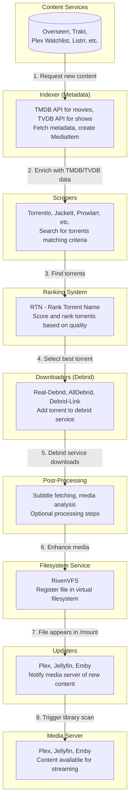

import { Callout } from "fumadocs-ui/components/callout";

# Architecture Overview

Riven is a comprehensive media management and streaming solution that automates the entire process of discovering, acquiring, and organizing media content for streaming through your media server.

---

## System Components

Riven consists of several key components that work together:

### 1. **Backend (Python)**

-   Built with FastAPI
-   PostgreSQL database for state management
-   Service-oriented architecture
-   RESTful API for frontend communication
-   Scheduler for automated tasks

### 2. **Frontend (SvelteKit)**

-   Modern Svelte-based web interface
-   Configuration management
-   Media browsing and search
-   Role based access control (in development)
-   Sqlite database for user management (different from backend database)

### 3. **RivenVFS (FUSE Filesystem)**

-   Virtual filesystem for media streaming
-   Built-in caching and prefetching
-   Direct integration with debrid services
-   No external dependencies (replaces rclone/zurg/decypharr)

### 4. **Database (PostgreSQL)**

-   Media item state tracking
-   Filesystem entry management
-   Settings storage
-   Stream metadata

---

## Workflow Architecture

Here's how Riven processes media from request to streaming:



---

## State Machine

Riven has a main `MediaItem` table and `Movie` and `Show` tables with foregin key relationship to `MediaItem`. There are 2 more tables `Episode` and `Season`.
`Episode` has foregin key relationship to `Season` & `MediaItem` and `Season` has foregin key relationship to `Show` & `MediaItem`.

`Movie`, `Show`, `Episode`, `Season` all just store the relationship & ids of the media item.

Each media item has it's own state, so a specific season can be completed but the show can be in ongoing state. The states can be seen below:

| State                  | Description                                      |
| ---------------------- | ------------------------------------------------ |
| **Unknown**            | Unknown state of the media                       |
| **Unreleased**         | Item has not been released yet                   |
| **Ongoing**            | Item is ongoing                                  |
| **Requested**          | Item has been requested from content service     |
| **Indexed**            | Metadata has been fetched from TMDB/TVDB         |
| **Scraped**            | Torrents have been found and ranked              |
| **Downloaded**         | Torrent added to debrid service                  |
| **Symlinked**          | File available and registered in VFS             |
| **Completed**          | Media servers have been notified                 |
| **PartiallyCompleted** | All the sub-items are not completed              |
| **Failed**             | Processing failed (requires manual intervention) |
| **Paused**             | Processing paused by user.                       |

```
Requested → Indexed → Scraped → Downloaded → Completed → Symlinked → Completed
```

There are additional states like

-   Unreleased - If item is not released it will go from Requested -> Indexed -> Unreleased
-   Ongoing - If item is ongoing it will go from Requested -> Indexed -> .... -> Symlinked -> Ongoing
-   PartiallyCompleted - If item is partially completed it will go from Requested -> Indexed -> .... -> Symlinked -> PartiallyCompleted

States can transition back on failures:

-   Scraped → Failed (if no suitable torrents found)
-   Failed → Scraped (on manual retry)
-   Completed → Scraped (if file deleted from debrid)

---

## Service Architecture

Riven uses a modular service-oriented architecture. Each service is independent and can be enabled/disabled individually.

### Content Services

Discover new media to add to your library:

-   **Overseerr**: Request management system
-   **Plex Watchlist**: RSS-based watchlist integration
-   **Mdblist**: Curated media lists
-   **Listrr**: Trakt list manager
-   **Trakt**: Watchlists, collections, trending, popular

### Scraper Services

Find torrents for requested media:

-   **Torrentio**: Popular Stremio addon
-   **Jackett**: Torrent indexer aggregator
-   **Prowlarr**: Indexer manager
-   **Zilean**: DMM hash lookup
-   **Comet**: Debrid-optimized scraper
-   **Mediafusion**: Multi-source aggregator
-   **Orionoid**: Premium torrent search
-   **Rarbg**: Torrent database search

### Downloader Services

Add torrents to debrid services:

-   **Real-Debrid**
-   **AllDebrid**
-   **Debrid-Link**

### Updater Services

Notify media servers of new content:

-   **Plex**: Plex Media Server integration
-   **Jellyfin**: Open-source media server
-   **Emby**: Feature-rich media server

### Post-Processing Services

Enhance downloaded media:

-   **Subtitle Service**: Fetch subtitles from various providers
-   **Media Analysis**: Analyze media files for metadata

---

## Database Schema (Simplified)

### MediaItem

Core entity representing a movie, show, season, or episode:

| Column          | Data Type                   |
| --------------- | --------------------------- |
| id              | integer                     |
| imdb_id         | character varying           |
| tvdb_id         | character varying           |
| tmdb_id         | character varying           |
| title           | character varying           |
| poster_path     | character varying           |
| type            | character varying           |
| requested_at    | timestamp without time zone |
| requested_by    | character varying           |
| requested_id    | integer                     |
| indexed_at      | timestamp without time zone |
| scraped_at      | timestamp without time zone |
| scraped_times   | integer                     |
| active_stream   | json                        |
| aliases         | json                        |
| is_anime        | boolean                     |
| network         | character varying           |
| country         | character varying           |
| language        | character varying           |
| aired_at        | timestamp without time zone |
| year            | integer                     |
| genres          | json                        |
| rating          | double precision            |
| content_rating  | character varying           |
| updated         | boolean                     |
| guid            | character varying           |
| overseerr_id    | integer                     |
| last_state      | USER-DEFINED (States enum)  |
| failed_attempts | integer                     |

### FilesystemEntry

Represents a file in the VFS:

| Column           | Data Type                   |
| ---------------- | --------------------------- |
| id               | integer                     |
| entry_type       | character varying           |
| file_size        | bigint                      |
| is_directory     | boolean                     |
| created_at       | timestamp without time zone |
| updated_at       | timestamp without time zone |
| available_in_vfs | boolean                     |
| media_item_id    | integer (foreign key)       |

### MediaEntry

Represents a media file entry from a debrid service:

| Column               | Data Type         |
| -------------------- | ----------------- |
| id                   | integer           |
| original_filename    | character varying |
| download_url         | character varying |
| unrestricted_url     | character varying |
| provider             | character varying |
| provider_download_id | character varying |
| library_profiles     | json              |
| media_metadata       | json              |

### Show

Represents a TV show:

| Column       | Data Type         |
| ------------ | ----------------- |
| id           | integer           |
| tvdb_status  | character varying |
| release_data | json              |

### Season

Represents a season of a TV show:

| Column    | Data Type |
| --------- | --------- |
| id        | integer   |
| number    | integer   |
| parent_id | integer   |

### Episode

Represents an episode of a TV show:

| Column          | Data Type |
| --------------- | --------- |
| id              | integer   |
| number          | integer   |
| parent_id       | integer   |
| absolute_number | integer   |

### Stream

Represents a torrent/magnet link:

| Column       | Data Type         |
| ------------ | ----------------- |
| id           | integer           |
| infohash     | character varying |
| raw_title    | character varying |
| parsed_title | character varying |
| rank         | integer           |
| lev_ratio    | double precision  |
| resolution   | character varying |

### StreamBlacklistRelation

Represents a blacklisted stream for a media item:

| Column        | Data Type |
| ------------- | --------- |
| id            | integer   |
| media_item_id | integer   |
| stream_id     | integer   |

### StreamRelation

Represents parent-child relationship between streams:

| Column    | Data Type |
| --------- | --------- |
| id        | integer   |
| parent_id | integer   |
| child_id  | integer   |

### ScheduledTask

Represents a scheduled task for media item:

| Column         | Data Type                   |
| -------------- | --------------------------- |
| id             | integer                     |
| item_id        | integer                     |
| task_type      | character varying           |
| scheduled_for  | timestamp without time zone |
| status         | USER-DEFINED                |
| created_at     | timestamp without time zone |
| executed_at    | timestamp without time zone |
| reason         | character varying           |
| offset_seconds | integer                     |

### SubtitleEntry

Represents a subtitle file:

| Column                   | Data Type         |
| ------------------------ | ----------------- |
| id                       | integer           |
| language                 | character varying |
| parent_original_filename | character varying |
| content                  | text              |
| file_hash                | character varying |
| video_file_size          | bigint            |
| opensubtitles_id         | character varying |

---

## RivenVFS Architecture

RivenVFS is a FUSE (Filesystem in Userspace) implementation that acts as a virtual filesystem for media files.

_This is under continuous development and rapid changes are expected._

---

## Configuration Management

Riven supports multiple configuration methods:

1. **Web Interface** (primary)

    - User-friendly settings UI
    - Real-time validation
    - Stored in settings file

2. **Environment Variables**

    - Prefix: `RIVEN_`
    - Format: `RIVEN_CATEGORY_SUBCATEGORY_SETTING`
    - Example: `RIVEN_FILESYSTEM_MOUNT_PATH=/mount`

3. **Settings File**
    - JSON-based configuration

Priority: Environment Variables > Settings File > Defaults

---

## Development Architecture

### Backend

-   **Language**: Python 3.12+
-   **Framework**: FastAPI
-   **ORM**: SQLAlchemy
-   **Database Migrations**: Alembic
-   **Task Scheduling**: APScheduler
-   **Async**: asyncio, trio (for FUSE)

### Frontend

-   **Framework**: Sveltekit 2 & Svelte 5
-   **Language**: TypeScript
-   **UI Library**: Shadcn/UI

### Build & Deploy

-   **Backend & Frontend**: Docker multi-stage builds
-   **Database**: PostgreSQL 17

---

## Monitoring & Logging

### Logging Levels

-   **INFO**: Standard operations
-   **DEBUG**: Detailed debugging info
-   **WARNING**: Non-critical issues
-   **ERROR**: Critical failures
-   **CRITICAL**: Critical failures
-   **TRACE**: Tracing info

### Health Checks

-   Database connectivity
-   VFS mount status
-   Debrid service availability
-   Media server connectivity

