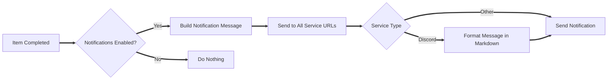

# Notifications Configuration

Riven integrates with Apprise to send notifications upon certain events. This allows you to receive alerts when Riven completes actions related to your media libraries.

<Callout>
**Apprise**

Apprise is a notification library that supports multiple notification services. You can find more information about it [here](https://github.com/caronc/apprise).
</Callout>

### Notification Settings

Below are the configurable notification settings for integrating Apprise with Riven:

- **enabled** (boolean): Enable or disable notifications.
    - Example: `true`
- **title** (string): The title of the notification.
    - Example: `"Riven completed something!"`
- **on_item_type** (list of strings): Specifies the types of items that trigger notifications. Common types include `movie`, `show`, and `season`.
    - Example:
        ```json
        "on_item_type": ["movie", "show", "season"]
        ```
- **service_urls** (list of strings): A list of Apprise service URLs to send notifications through. Each URL corresponds to a notification service provider.
    - Example:
        ```json
        "service_urls": [
            "discord://xxxxxxxxxxxxxxx/xxxxxxxxxxxxxxxxxxxxxxxxxxxxxxxxxxxxxxxxxxxxxxxxxxxxxxxxxxxxxxxx"
        ]
        ```

<Callout>
**Discord**

To get your Discord webhook URL, you can follow these steps:

- Go to your server settings.
- Navigate to the "Integrations" section.
- Click on "Webhooks" and follow the steps to create a new webhook.
- Copy the webhook URL and use it in the `service_urls` list.
</Callout>

---

## How Notifications Work

Riven uses the Apprise library to handle notifications. When certain events occur, such as completing a download or processing a media item, Riven sends notifications to the configured services. Here's a breakdown of how notifications are managed:

1. **Initialization**:
    - Riven initializes the Apprise notifier (`ntfy`) and loads the notification settings from the configuration.
    - All service URLs provided in the `service_urls` list are added to the Apprise notifier. If adding a service URL fails, a debug message is logged.

2. **Sending Notifications**:
    - When an event that should trigger a notification occurs, Riven constructs a notification message based on the type of media item (e.g., movie, show, season, episode).
    - The notification includes details such as the item's name and the files that were processed.
    - Riven then sends the notification to all configured services. If the service is Discord, the message is formatted in Markdown for better readability.

3. **Error Handling**:
    - If sending a notification fails for a particular service, Riven logs a debug message and continues sending notifications to the remaining services.

---

## Configuring Notifications

To set up and customize notifications in Riven, follow these steps:

### 1. Enable Notifications

Ensure that notifications are enabled in your configuration file.

```json
"enabled": true
```

Setting this to `false` will disable all notifications.

### 2. Set the Notification Title

Customize the title of your notifications to something meaningful.

```json
"title": "Riven has updated your library!"
```

If not set, the default title `"Riven completed something!"` will be used.

### 3. Choose Item Types for Notifications

Specify which types of media items should trigger notifications. Common types include `movie`, `show`, `season`, and `episode`.

```json
"on_item_type": ["movie", "show", "season"]
```

Only events related to the specified item types will send notifications.

### 4. Add Notification Services

Integrate with your preferred notification services by adding their Apprise service URLs.

#### Example: Adding a Discord Webhook

1. **Create a Discord Webhook**:
    - Go to your Discord server settings.
    - Navigate to the "Integrations" section.
    - Click on "Webhooks" and create a new webhook.
    - Copy the webhook URL provided by Discord.

2. **Add the Webhook to Riven's Configuration**:

```json
"service_urls": [
    "discord://your_discord_webhook_url_here/?format=markdown"
]
```

The `?format=markdown` query parameter ensures that messages are formatted correctly in Discord.

#### Supported Services

Apprise supports a wide range of notification services, including but not limited to:

- **Email**
- **Slack**
- **Telegram**
- **Pushbullet**
- **Pushover**

And more! Refer to the [Apprise documentation](https://github.com/caronc/apprise) for a full list of supported services and how to obtain their service URLs.

### 5. Apply and Test Your Configuration

After updating your configuration file:

1. **Restart Riven** to apply the changes.
2. **Trigger an Event** that should send a notification (e.g., complete a media download).
3. **Verify** that you receive the notification through your configured service(s).

### Troubleshooting

- **No Notifications Received**:
    - Ensure that `enabled` is set to `true`.
    - Verify that your `service_urls` are correct and active.
    - Check the Riven logs for any error messages related to notifications.

- **Formatting Issues in Discord**:
    - Make sure the Discord webhook URL includes `?format=markdown`.
    - Verify that your message content adheres to Discord's Markdown formatting rules.

---

## Customizing Notification Messages

While Riven provides default templates for notification messages, you can customize them to better suit your needs.

### Default Message Structure

Depending on the type of media item, the notification message will include different levels of detail.

- **Movie**:
    ```
    [Movie] **Example Movie**
      - File: /path/to/movie/file.mkv
    ```

- **Show**:
    ```
    [Show] **Example Show**
    - [Season 1] **Season 1**
      - [Episode 1] **Episode 1 Title**
        - File: /path/to/episode/file.mkv
    ```

- **Season**:
    ```
    [Season] **Season 1**
      - [Episode 1] **Episode 1 Title**
        - File: /path/to/episode/file.mkv
    ```

- **Episode**:
    ```
    [Episode] **Episode 1 Title**
      - File: /path/to/episode/file.mkv
    ```

### Advanced Customization

<Callout>
**Apprise Config Files**

For advanced users who wish to further customize the notification behavior or message format, you can also use config files with Apprise. Just add the path to the `service_urls` list!
</Callout>

---

## Notification Flow Diagram


